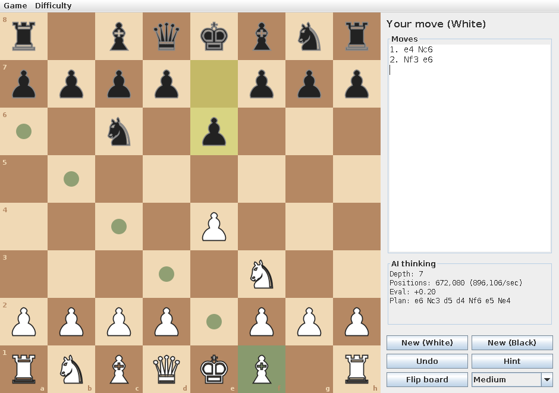

# Java Chess Engine

A complete chess game written from scratch in Java, with an AI opponent that looks
several moves ahead to choose its moves. You can play it in a window, in the terminal,
or plug it into real chess software as an engine.



## The problem it solves

Chess is a classic hard problem for computers. There are about 20 possible first moves,
400 positions after one move each, nearly 200,000 after two, and the number keeps
multiplying, so a program can't just try everything. A chess engine has to solve two
problems:

1. **Know the rules exactly.** Castling, en passant, promotion, pinned pieces, check,
   checkmate, stalemate and the draw rules all have to be right. One mistake means
   illegal moves or missed checkmates.
2. **Choose good moves quickly.** It has to search millions of possible futures and
   decide, within a time limit, which move leads to the best result, assuming the
   opponent also plays well.

This project solves both with no chess libraries. Every rule and every part of the AI is
written here in plain Java.

## Features

- **Full chess rules**: castling, en passant, promotion (to any piece), check,
  checkmate, stalemate, threefold repetition, the fifty-move rule and insufficient material.
- **Rules proven correct**: the move generator reproduces the official
  ["perft" counts](https://www.chessprogramming.org/Perft_Results) used to test real
  chess engines, on positions built to catch every tricky rule.
- **An AI opponent** that searches hundreds of thousands of positions per second, with
  three difficulty levels.
- **A game window (Swing)**: click to move, legal-move hints, last-move and check
  highlighting, move list in standard notation, undo, hints, board flipping, and a live
  view of what the AI is "thinking" (its search depth, evaluation and planned line).
- **Console mode**: play in the terminal by typing moves like `e4` or `Nf3`.
- **UCI mode**: speaks the Universal Chess Interface, the protocol real chess software
  uses, so you can load it into free programs like
  [Arena](http://www.playwitharena.de/) or [Cute Chess](https://cutechess.com/) and
  have it play other engines.
- **42 automated tests** (JUnit 5), run on every push by GitHub Actions.

## How to run it

You only need **Java 17 or newer** (check with `java -version`). You don't need to
install Maven: the project includes the Maven Wrapper (`mvnw`), which downloads the
right Maven version automatically the first time you run it.

```bash
# 1. Build it (this also runs all the tests)
./mvnw package          # macOS / Linux
.\mvnw.cmd package      # Windows (PowerShell or Command Prompt)

# 2. Play in a window
java -jar target/chess-engine.jar
```

Click a piece to see its legal moves (dots), then click where to move it. Use
**New (Black)** to play as Black, and the drop-down (or the **Difficulty** menu) to pick
Easy, Medium or Hard.

Other ways to run it:

```bash
# Play in the terminal (type "help" for commands)
java -jar target/chess-engine.jar --console

# Ask the AI for the best move in any position (FEN), thinking for 5 seconds
java -jar target/chess-engine.jar --analyze "r1bqkbnr/pppp1ppp/2n5/4p3/2B1P3/5Q2/PPPP1PPP/RNB1K1NR w KQkq - 0 1" 5

# Speed test: count every position 5 moves deep (should print 4,865,609)
java -jar target/chess-engine.jar --perft 5

# Run as a UCI engine (for chess GUIs like Arena or Cute Chess)
java -jar target/chess-engine.jar --uci
```

To use it in a chess GUI, add a new engine and point it at a small script that runs
`java -jar /full/path/to/chess-engine.jar --uci`.

Run only the tests with:

```bash
./mvnw test             # or .\mvnw.cmd test on Windows
```

## How it works

The code is split into four parts, each in its own package:

```
src/main/java/chess/
├── core/   the rules: board, moves, move generation, notation
├── ai/     the "brain": evaluation and search
├── ui/     the game window (Swing)
├── cli/    terminal mode
├── uci/    chess-GUI protocol
└── Main.java   picks the mode from the command-line arguments
```

### 1. Representing the board (`core/Board.java`)

The board is an array of 64 numbers, one per square (a1 is 0, h8 is 63). Each number
says what piece is there (or 0 for empty). Besides the pieces, the board remembers whose
turn it is, which castling moves are still allowed, whether en passant is possible, and
the move counters, the same information as a [FEN](https://en.wikipedia.org/wiki/Forsyth%E2%80%93Edwards_Notation)
string, which the program can read and write.

A move is **made** and **unmade** in place. The board keeps a history stack of what it
needs to undo each move. The AI depends on this: instead of copying the board millions
of times, it plays a move, looks at the result, and takes it back.

### 2. Finding legal moves (`core/MoveGenerator.java`)

First it lists every move each piece could make by how it moves (knights jump, bishops
slide diagonally until blocked, and so on). Then it plays each one and throws away any
move that leaves your own king in check. That second step is what handles pins and
"you can't move into check" without special-case code.

**How do we know it's right?** "Perft" counts every position reachable in N moves. Chess
programmers have published these counts for standard test positions, which are full of
castling, en passant and promotion traps. `PerftTest` checks our counts against them
(for example, 197,281 positions after 4 moves from the start, and 422,333 for a nasty
promotion-heavy position). If any rule were wrong, the numbers wouldn't match.

### 3. Judging a position (`ai/Evaluator.java`)

To decide whether a position is good, the evaluator adds up a score in "centipawns"
(100 = one pawn):

- **Material**: pawn 100, knight 320, bishop 330, rook 500, queen 900.
- **Piece placement**: each piece type has a table of bonuses for each square. Knights
  get a bonus in the center and a penalty on the edge, pawns get a bonus for advancing,
  and the king prefers to hide behind pawns early on but walk to the center in the
  endgame. The program blends the two king tables depending on how many pieces are left.
- **Bishop pair**: a small bonus for keeping both bishops.

### 4. Looking ahead (`ai/Engine.java`)

This is the core of the AI. It uses the same ideas as real chess engines:

- **Minimax**: imagine every move, then every reply, then every reply to that, and
  so on. At the bottom, score the position. Assume each side always picks the move best
  for itself, and pass the scores back up. The move with the best guaranteed outcome wins.
- **Alpha-beta pruning**: if you've already found a move that wins a knight, and
  while checking another move you see the opponent has a reply that wins your queen,
  you can stop looking at that move. It's already worse. This skips most of the tree
  without changing the answer.
- **Iterative deepening**: search 1 move deep, then 2, then 3, and so on until the time
  limit is reached. That way there's always a finished answer ready, and each search
  helps the next one try good moves first.
- **Quiescence search**: stopping in the middle of a trade gives wrong answers
  ("I took their queen!" and then they take back). So at the end of the search, the engine
  keeps following captures until the position is calm.
- **Transposition table**: the same position can be reached by different move orders.
  Each position gets a 64-bit fingerprint (a [Zobrist hash](https://en.wikipedia.org/wiki/Zobrist_hashing)),
  and results are stored in a big table keyed by it so the work isn't repeated.
- **Move ordering**: alpha-beta prunes most when the best move is tried first. So it
  tries the best move from the previous search first, then captures (most valuable
  victim first), then "killer" moves that caused cut-offs elsewhere at the same depth.
- **Check extension and mate scoring**: when in check the engine searches one move
  deeper, and it prefers faster checkmates, so it reports results like "mate in 3".

### 5. The window (`ui/`)

`BoardPanel` draws the board and pieces and turns clicks into moves. `ChessWindow` runs
the game. The AI thinks on a background thread (`SwingWorker`) so the window stays
responsive, and it streams its progress to the "AI thinking" box after each depth.

## Tests

`./mvnw test` runs 42 tests:

| Test class      | What it checks |
|-----------------|----------------|
| `PerftTest`     | Move counts match the published numbers for 6 standard test positions |
| `BoardTest`     | FEN reading/writing, checkmate, stalemate, repetition, 50-move rule, castling, en passant, promotion, and that make/unmake restores the board perfectly over thousands of random moves |
| `NotationTest`  | Moves are written and read in standard notation (`Nbd2`, `exd5`, `O-O`, `a8=Q+`, `Qh4#`) |
| `EngineTest`    | The AI solves puzzles: mates in 1 and 2, a smothered mate, a knight fork, a hanging queen. It also respects its time limit and leaves the board untouched |

## Possible extensions

- An opening book so it varies its first moves
- Pawn-structure terms in the evaluation (passed, doubled and isolated pawns)
- Null-move pruning and late-move reductions to search deeper
- Saving and loading games in PGN format
